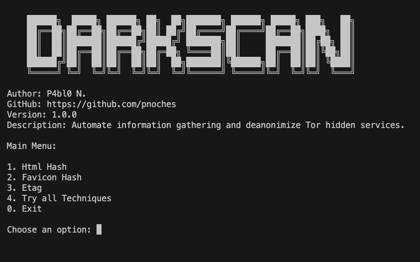
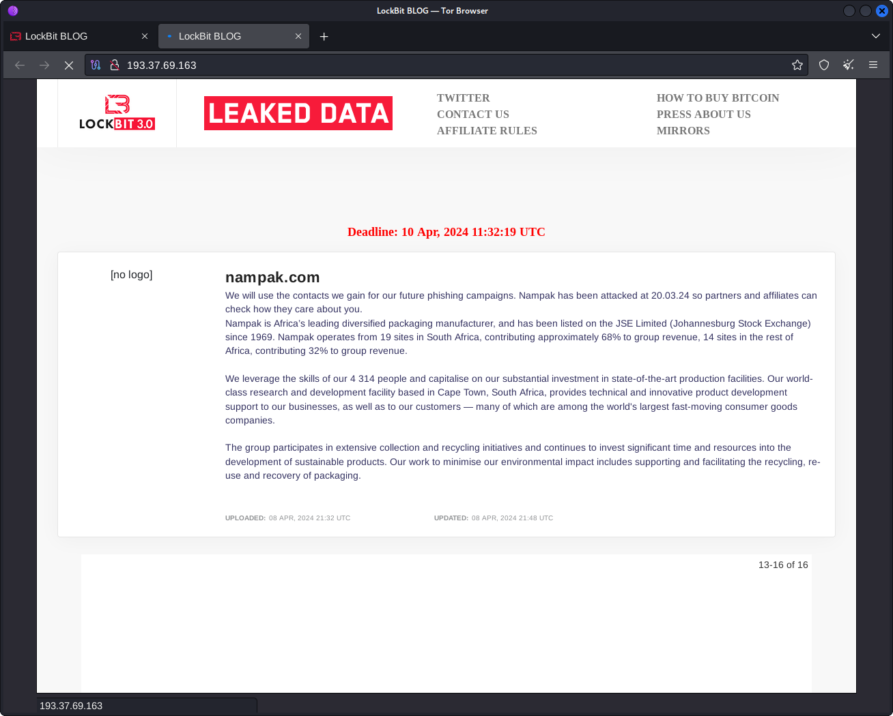

 # Darkscan

Automate information gathering and deanonimize Tor hidden services.

## **How it works?**

This is a simple tool developed in Python and it uses three techniques to try to find the real IP Address of the Tor Hidden Services (.onion).

This tool uses IoT Search Engine API like **Shodan, BinaryEdge, FOFA** and **URLScanIO** to does his work, calculating differents data and try to make match into them to find the Real IP.

> **NOTE:** Could you get some false positive information, in this case, go to the search engine page and verify the IP Ports on the server and see what is going on.

## **Techniques**

 1.  **Html Hash:** efers to a unique hash value generated from the HTML content of a web server's response. These platforms scan and index internet-connected devices by collecting data from web servers, including the HTML content served by them.
 
 2.  **Favicon Hash:** Is a unique hash value generated from a website's favicon, the small icon displayed in browser tabs. By creating a hash (usually using MD5 or SHA) from the favicon, these search engines can identify and group servers or devices using the same favicon, which often indicates a shared software or platform. This helps in identifying specific web applications, services, or devices by their favicon, allowing users to search for and discover similar systems across the internet more easily.
 
 3. **ETag:** Is an HTTP header used for web caching, helping browsers and servers determine if a resource has changed. When a client requests a resource, the server responds with an ETag, a unique identifier representing the resource's version.

## Installation

> [!IMPORTANT]: 
> You need to have Tor service installed and running over **"socks5h://localhost:9050"**
> `brew install tor` (OSX)
> `apt install tor` (Debian-based)
>
Then:

    $ git clone https://github.com/pnoches/darkscan.git
    $ cd darkscan/
    $ pip install requirements.txt
    $ python main.py

## Images

## Conclusion

This tiny tool was developed with learning purposes to show you that is possible to get the real IP or maybe the reverse proxy IP behind the Tor network websites, the are more techniques, IoT search engines and Darknets to use and include in this tool, but I didn't include all the meat in this Barbecue.

I'm working in the next step of this development to take it to the next level.

> [!IMPORTANT]
> If you want to be part of this and contribute in the evolution of this tool, feel free to let me know.